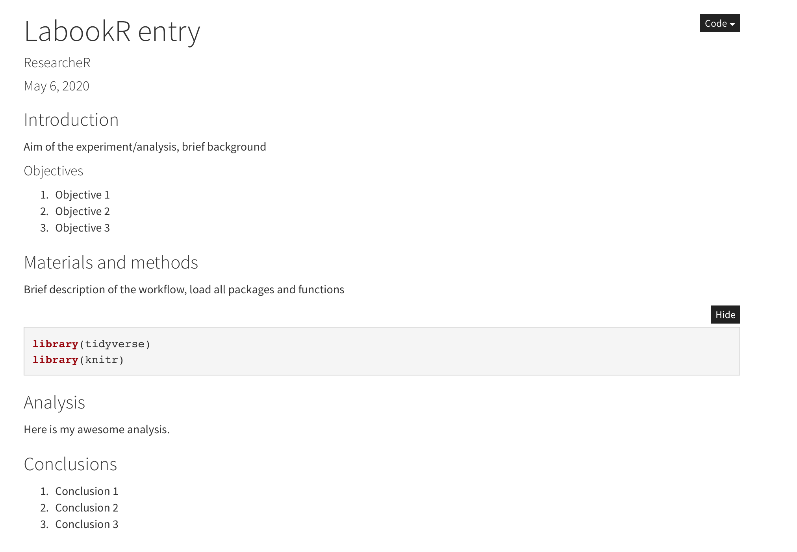
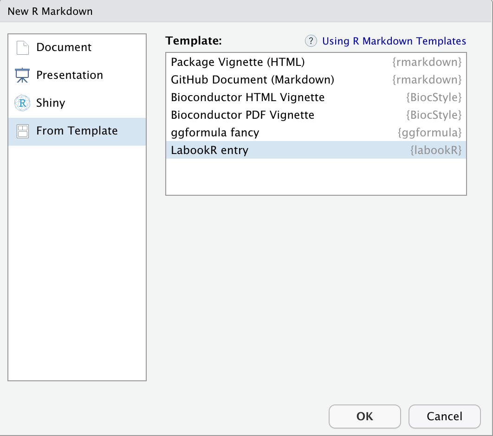

# labookR
Open science project to create unified Electronic Lab Notebook (ELN) framework using R syntax in order to support research data reproducibility, facilitate data analysis and projects management.  

## Background   

There is an intense effort to improve reproducibility and transparency in modern research culture, so it is not surprising that ELN slowly supersede its paper ancestor. Most of the avaliable ELN lacks flexibility, cannot be taliored to one's needs and are not open source, which may limit their accessibility. 

---

## How to start?  

At its infant stage `labookR` works as a simple `R markdown` template that encourages you to organise and unify your analyses/experiments structure on question-answer basis. 

###### Template of a basic labookR entry:   


#### Option 1. 

In order to start a new entry you can just download the basic `basicTemplate.Rmd` file and expand it according to your need. 

#### Option 2.  

You can add the `basicTemplate.Rmd` as a `R Markdown` template that can be loaded automatically when a new `R markdown` file is created. In order to make it work you need to have RStudio and `devtools` R package installed. Then you need to donwload and install 'labookR' package that will automatically add the basic entry template to your R environment.  

1. Clone the repository. 
```
git clone https://github.com/hibernicah/labookR.git
```
2. Open `Rstudio` and navigate to `./labookR`. 
3. Install `labookR` with devtools. 
```
devtools::install("labookR")
```
4. We can now test that the template is working by navigating to New R Markdown dialog (File - New File - R markdown) and selecting `From Template` from the menu. You should now see LabookR entry, as below:  




------

### Further development

If you like this idea of creating open-source and flexible ELN, you are invited to contribute. Planned core functionality is as follows:  

* R notebooks with enhanced functionality, eg. easy import of repeated experimental protocols.  
* Modular design, tag-based project management with interactive project/experiment access (entry - metadata).  
* Integrated version control system (eg. git).  
* R syntax access to archived experiments/protocols/projects (output could be organised from different levels and published as eg. Shiny app). 
* Media upload syntax (eg. to attach WB gels, flow cytometry charts etc.).  
* Expanded tutorials and manuals for non-coding users. 


